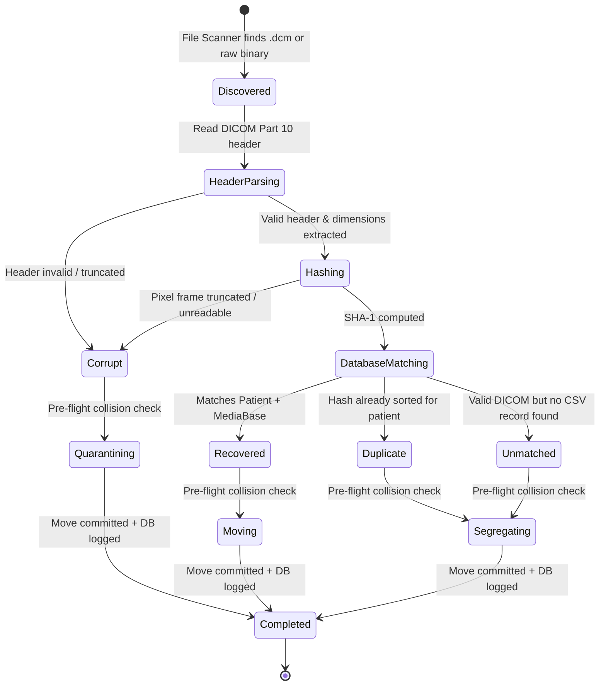

# Data Model: SIDEXIS DICOM Recovery & Sorter (dcmsiv)

**Feature**: SIDEXIS DICOM Recovery & Sorter  
**Branch**: `001-sidexis-dicom-recovery`  
**Date**: 2026-09-19  

## Domain Entities & In-Memory Representation

### 1. Patient Entity
Extracted from `Patient.csv` and indexed in memory for $O(1)$ lookups.

| Field | Type | Description |
| :--- | :--- | :--- |
| `patient_id` | `i64` | Internal incremental primary key unique per SIDEXIS server |
| `internal_card_id` | `String` | Practice/clinic-wide unique chart identifier (used as directory name) |

**Validation Rules**:
- `patient_id` must parse as a valid non-empty integer.
- `internal_card_id` must be non-empty; characters invalid in Windows/POSIX paths are sanitized for folder names while keeping the raw string for matching.

---

### 2. MediaBase Entity
Extracted from `MediaBase.csv`. Multiple rows may share the same `RootNode`, indicating multiple representations/states of the same physical file.

| Field | Type | Description |
| :--- | :--- | :--- |
| `patient_id` | `i64` | Foreign key referencing `Patient.patient_id` |
| `root_node` | `String` | Unifying identifier grouping database entries for the same physical file |
| `creation_date` | `NaiveDateTime` | Image acquisition timestamp (corresponds to DICOM `AcquisitionDateTime`) |
| `media_hash` | `String` | SHA-1 hexadecimal checksum of the middle layer (volume) or single layer (raster) |

**Validation Rules**:
- `media_hash` must be a 40-character hexadecimal string (normalized to lowercase).
- Total distinct media files in the database is defined as:
  $$\text{TotalMediaFiles} = |\text{Unique } \text{root\_node}|$$

---

### 3. Candidate DICOM Asset
Represents an individual physical file discovered in the input recovery directory.

| Field | Type | Description |
| :--- | :--- | :--- |
| `source_path` | `PathBuf` | Current absolute or relative file path on disk |
| `file_size` | `u64` | File size in bytes |
| `mtime` | `i64` | Unix modification timestamp |
| `patient_id_tag` | `Option<String>` | Extracted from DICOM Tag `(0010, 0020)` |
| `other_patient_ids_tag`| `Option<String>` | Fallback from DICOM Tag `(0010, 1000)` |
| `acquisition_datetime`| `Option<NaiveDateTime>`| Extracted from Tag `(0008, 002A)` or fallback date/time tags |
| `layer_count` | `usize` | Total number of frames (`(0028, 0008)`), defaults to 1 if absent |
| `middle_layer_index` | `usize` | $\lfloor \text{layer\_count} / 2 \rfloor$ |
| `samples_per_pixel` | `u16` | Samples per pixel (`(0028, 0002)`), 1 for mono, 3 for RGB |
| `photometric_interpretation`| `Option<String>`| Photometric interpretation (`(0028, 0004)`), e.g. "RGB", "MONOCHROME2" |
| `planar_configuration` | `u16` | Planar configuration (`(0028, 0006)`), 0 for interleaved RGB |
| `computed_hash` | `Option<String>` | Computed SHA-1 checksum of the middle/single pixel layer (layout-specific) |
| `disposition` | `FileDisposition` | Final classification category |
| `destination_path` | `Option<PathBuf>` | Target path after sorting / quarantine |
| `error_reason` | `Option<String>` | Error message if classified as corrupt |

---

### 4. Pixel Hashing Rules by Image Layout

| Layout | Channel Order | Row Alignment | Hashing Target |
| :--- | :--- | :--- | :--- |
| **16-bit MONOCHROME2** (Single-layer, 1 sample/pixel) | As-is | None (raw bytes) | Full pixel data value field as stored |
| **8-bit RGB Interleaved** (Single-layer, `PlanarConfiguration = 0`) | Swap bytes 1 & 3 of every 3-byte pixel (`R, G, B` $\rightarrow$ `B, G, R`) | Each row padded to 4-byte (DWORD) boundary (`pad_per_row = (4 - (Columns × 3) % 4) % 4`) | Windows DIB layout: `Rows × (Columns × 3 + pad_per_row)` bytes, top-to-bottom, DICOM trailing pad byte excluded |
| **Multi-layer (CBCT Volume)** ($N > 1$ frames) | As-is per frame | None (raw bytes) | Target middle frame buffer at offset $\lfloor N / 2 \rfloor \times \text{FrameSize}$ |

---

## File Disposition States & Lifecycle



### Classification Enum (`FileDisposition`)
- `Recovered`: Matches both `Patient.csv` and `MediaBase.csv` (by `InternalCardId` and `MediaHash`).
- `Corrupt`: Broken preamble, invalid DICOM VR encoding, truncated middle frame, or I/O failure.
- `Duplicate`: Identical media hash and patient to a file already moved during this recovery session.
- `Unmatched`: Syntactically valid DICOM file, but no matching record exists in the SIDEXIS database tables.

---

## Embedded SQLite State Database Schema (`.dcmsiv_state.db`)

Stored in `<output_dir>/.dcmsiv_state.db`. Initialized automatically on first run.

```sql
PRAGMA journal_mode = WAL;
PRAGMA synchronous = NORMAL;

-- Tracks all candidate files and their processing status
CREATE TABLE IF NOT EXISTS scanned_files (
    file_path TEXT PRIMARY KEY,
    file_size INTEGER NOT NULL,
    mtime INTEGER NOT NULL,
    patient_identifier TEXT,
    acquisition_datetime TEXT,
    layer_count INTEGER,
    middle_layer_index INTEGER,
    media_hash TEXT,
    status TEXT NOT NULL, -- 'pending', 'recovered', 'corrupt', 'duplicate', 'unmatched'
    target_path TEXT,
    error_message TEXT,
    processed_at TEXT NOT NULL
);

CREATE INDEX IF NOT EXISTS idx_scanned_status ON scanned_files(status);
CREATE INDEX IF NOT EXISTS idx_scanned_hash ON scanned_files(media_hash);

-- Transaction journal for crash resilience and --undo rollbacks
CREATE TABLE IF NOT EXISTS transactions (
    id INTEGER PRIMARY KEY AUTOINCREMENT,
    source_path TEXT NOT NULL,
    destination_path TEXT NOT NULL,
    operation_type TEXT NOT NULL, -- 'move' or 'copy'
    status TEXT NOT NULL,         -- 'committed' or 'rolled_back'
    timestamp TEXT NOT NULL
);

CREATE INDEX IF NOT EXISTS idx_trans_status ON transactions(status);

-- Snapshot of unique RootNodes matched from MediaBase
CREATE TABLE IF NOT EXISTS recovered_root_nodes (
    root_node TEXT PRIMARY KEY,
    first_recovered_file TEXT NOT NULL,
    patient_id INTEGER NOT NULL
);
```

---

## Transaction & Undo Reversibility

When `--undo <output_dir>` is invoked:
1. The tool opens `<output_dir>/.dcmsiv_state.db`.
2. Queries all entries in `transactions` where `status = 'committed'` and `operation_type = 'move'`, ordered by `id DESC`.
3. For each entry:
   - Verifies that `destination_path` exists on disk.
   - Moves the file from `destination_path` back to `source_path`.
   - Updates `transactions` row to `status = 'rolled_back'`.
4. Updates `scanned_files` table to set `status = 'pending'`.
5. Removes empty patient folders if they become vacant.
