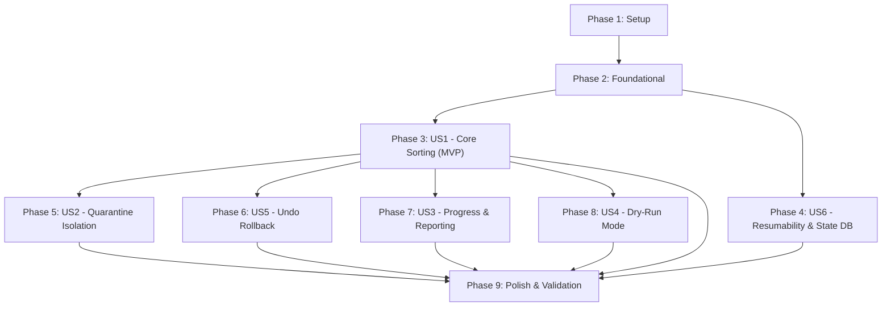

# Implementation Tasks: SIDEXIS DICOM Recovery & Sorter (dcmsiv)

**Feature**: SIDEXIS DICOM Recovery & Sorter  
**Branch**: `001-sidexis-dicom-recovery`  
**Plan**: [plan.md](plan.md) | **Spec**: [spec.md](spec.md)  

---

## Phase 1: Setup (Shared Infrastructure)

**Purpose**: Project initialization and basic structure

- [ ] T001 Initialize Rust package `dcmsiv` with 2021 edition and binary target in `Cargo.toml`
- [ ] T002 Add dependencies (`clap`, `rayon`, `rusqlite`, `csv`, `sha1`, `indicatif`, `serde`, `serde_json`, `chrono`, `crossbeam-channel`) to `Cargo.toml`
- [ ] T003 [P] Create core module directory layout (`src/dicom`, `src/db`, `src/engine`, `src/report`) and entry point stubs in `src/main.rs`
- [ ] T004 [P] Create synthetic DICOM generator utility (zero PHI) for automated testing in `tests/common/synthetic_dicom.rs`

---

## Phase 2: Foundational (Blocking Prerequisites)

**Purpose**: Core data structures, database connectors, and CLI configuration that all user stories depend on

**⚠️ CRITICAL**: No user story work can begin until this phase is complete

- [ ] T005 [P] Define core domain types (`PatientRecord`, `MediaBaseRecord`, `DicomScan`, `FileDisposition`) in `src/dicom/types.rs`
- [ ] T006 [P] Implement streaming CSV parser and indexer validating `PatientId`, `InternalCardId`, `CreationDate`, `MediaHash`, and `RootNode` in `src/db/csv_reader.rs`
- [ ] T007 [P] Create embedded SQLite state database initialization with WAL mode (`PRAGMA journal_mode=WAL; PRAGMA synchronous=NORMAL;`) in `src/db/state_store.rs`
- [ ] T008 Implement CLI argument parser with `clap` derive for `--input`, `--output`, `--patient-csv`, `--mediabase-csv`, `--copy`, `--dry-run`, `--undo`, and `--reset-state` in `src/cli.rs`
- [ ] T009 Implement runtime configuration resolver mapping CLI flags and standard exit codes (0, 1, 2, 3, 4) in `src/config.rs`

**Checkpoint**: Foundation ready - user story implementation can now begin in parallel

---

## Phase 3: User Story 1 - Core DICOM Identification, Verification & Sorting (Priority: P1) 🎯 MVP

**Goal**: Discover candidate files, parse headers, compute middle/single layer SHA-1 hashes via positional seeks, match against SIDEXIS database tables, and move files into `<output>/<InternalCardId>/` with zero file overwrites.

**Independent Test**: Provide synthetic single-layer and multi-layer DICOMs with matching `Patient.csv` and `MediaBase.csv`; execute `dcmsiv`; verify files are moved to `<InternalCardId>/RasterImage_<DateTime>.dcm` and `<InternalCardId>/Volume_<DateTime>.dcm` with zero data loss.

### Tests for User Story 1

- [ ] T010 [P] [US1] Create unit tests for DICOM Part 10 preamble and tag extraction (`PatientID`, `RETIRED_OtherPatientIDs`, `AcquisitionDateTime`, dimensions) in `tests/unit/header_tests.rs`
- [ ] T011 [P] [US1] Create unit tests for positional seek and middle-layer SHA-1 hashing formula ($\lfloor N/2 \rfloor \times \text{frame\_size}$) in `tests/unit/hasher_tests.rs`
- [ ] T012 [P] [US1] Create integration test for end-to-end recovery and non-destructive move sorting in `tests/integration/recovery_tests.rs`

### Implementation for User Story 1

- [ ] T013 [US1] Implement streaming DICOM Part 10 header reader extracting `PatientID` (0010,0020), `RETIRED_OtherPatientIDs` (0010,1000), `AcquisitionDateTime` (0008,002A), and frame dimensions in `src/dicom/header.rs`
- [ ] T014 [US1] Implement positional seek and middle-layer SHA-1 stream calculator reading only $\lfloor N/2 \rfloor$ frame bytes in `src/dicom/hasher.rs`
- [ ] T015 [US1] Implement database matching logic cross-referencing candidate scans against in-memory indexed `Patient` and `MediaBase` records in `src/engine/processor.rs`
- [ ] T016 [US1] Implement collision-safe file mover (`std::fs::rename` with stream copy fallback) with naming `Volume_<FormattedDateTime>.dcm` or `RasterImage_<FormattedDateTime>.dcm` in `src/engine/sorter.rs`
- [ ] T017 [US1] Wire core MVP discovery and parallel sorting pipeline with `rayon` in `src/main.rs`

**Checkpoint**: User Story 1 is fully functional and testable as an MVP

---

## Phase 4: User Story 6 - Interruption Recovery & Resumable Execution (Priority: P1)

**Goal**: Save all scan progress and file state transitions into `.dcmsiv_state.db` using WAL transactions; allow restarting after SIGINT or crash to resume seamlessly without re-hashing or re-moving completed files.

**Independent Test**: Start processing a batch of synthetic files, interrupt via SIGINT (Ctrl+C), re-run the command on the same directory, and verify it resumes from the exact point of interruption without duplicating work.

### Tests for User Story 6

- [ ] T018 [P] [US6] Create integration test for process interruption and state resumption from `.dcmsiv_state.db` in `tests/integration/resume_tests.rs`

### Implementation for User Story 6

- [ ] T019 [US6] Implement lock-free MPSC channel and background SQLite writer thread batching state inserts in `src/db/state_store.rs`
- [ ] T020 [US6] Implement resume detection querying `scanned_files` to skip already completed files on startup in `src/engine/processor.rs`
- [ ] T021 [US6] Implement signal handling for SIGINT and SIGTERM to trigger graceful flush and database closure in `src/main.rs`
- [ ] T022 [US6] Implement `--reset-state` flag to wipe existing `.dcmsiv_state.db` and re-evaluate all files from scratch in `src/engine/processor.rs`

**Checkpoint**: Recovery is resilient to crashes and can be paused/resumed indefinitely

---

## Phase 5: User Story 2 - Quarantine of Corrupt, Duplicate & Unmatched Files (Priority: P2)

**Goal**: Safely isolate unreadable DICOMs into `corrupt/`, duplicate scans into `duplicates/`, and unindexed DICOMs into `unmatched/` without overwriting prior files.

**Independent Test**: Feed truncated files, duplicate hashes, and unlisted patient IDs; verify that damaged files land in `corrupt/`, duplicate scans land in `duplicates/` with distinct suffixes, and unlisted files land in `unmatched/`.

### Tests for User Story 2

- [ ] T023 [P] [US2] Create integration tests for corrupt, duplicate, and unmatched quarantine routing in `tests/integration/quarantine_tests.rs`

### Implementation for User Story 2

- [ ] T024 [US2] Implement corrupt file classification and isolation into `<output>/corrupt/` with failure reason logging in `src/engine/sorter.rs`
- [ ] T025 [US2] Implement duplicate file segregation into `<output>/duplicates/` with unique collision-free suffixes in `src/engine/sorter.rs`
- [ ] T026 [US2] Implement unmatched valid DICOM scan routing into `<output>/unmatched/` in `src/engine/sorter.rs`

**Checkpoint**: Corrupted and duplicate data are completely isolated from clinical patient directories

---

## Phase 6: User Story 5 - Reverting Operations via Undo Flag (Priority: P2)

**Goal**: Provide an `--undo <OUTPUT_DIR>` command that queries the SQLite transaction journal and atomically restores all moved files to their original pre-sorting paths.

**Independent Test**: Run a sorting operation in `move` mode, run `dcmsiv --undo <OUTPUT_DIR>`, and verify that 100% of sorted files return to the original input directory.

### Tests for User Story 5

- [ ] T027 [P] [US5] Create integration test for `--undo` rollback fidelity in `tests/integration/undo_tests.rs`

### Implementation for User Story 5

- [ ] T028 [US5] Implement transaction logging in `transactions` table during move operations in `src/db/state_store.rs`
- [ ] T029 [US5] Implement undo rollback engine restoring files from destination to source in reverse order in `src/engine/undo.rs`
- [ ] T030 [US5] Wire CLI `--undo <OUTPUT_DIR>` invocation and error reporting in `src/main.rs`

**Checkpoint**: All move operations are 100% reversible via `--undo`

---

## Phase 7: User Story 3 - Progress Indication & Comprehensive Reporting (Priority: P3)

**Goal**: Display an interactive progress bar during execution, calculate distinct `RootNode` recovery percentages against `MediaBase`, print the summary report to terminal stdout, and save persistent report files.

**Independent Test**: Run a batch and verify interactive progress bar rendering, followed by formatted terminal summary on stdout and matching counts in `recovery_report.json` and `recovery_report.txt`.

### Tests for User Story 3

- [ ] T031 [P] [US3] Create unit tests for distinct `RootNode` deduplication and recovery percentage calculations in `tests/unit/summary_tests.rs`

### Implementation for User Story 3

- [ ] T032 [US3] Implement thread-safe `indicatif` progress bar tracking processed count, rate (files/sec), and ETA in `src/report/progress.rs`
- [ ] T033 [US3] Implement distinct `RootNode` recovery rate calculation: `Recovered unique RootNodes / Total distinct RootNodes in MediaBase * 100%` in `src/report/summary.rs`
- [ ] T034 [US3] Implement formatted stdout summary table and raw `--json` stdout output mode in `src/report/summary.rs`
- [ ] T035 [US3] Implement persistent report writers generating `recovery_report.json` and `recovery_report.txt` in `<output_dir>` in `src/report/summary.rs`

**Checkpoint**: Observability is complete with live progress and audit reporting

---

## Phase 8: User Story 4 - Non-Destructive Preview / Dry-Run Execution (Priority: P4)

**Goal**: Allow operators to simulate recovery using `--dry-run` to preview matches, report metrics, and verify CSV data without modifying disk state.

**Independent Test**: Run `dcmsiv --dry-run`; verify that the terminal report is generated but 0 files are moved, copied, or modified.

### Tests for User Story 4

- [ ] T036 [P] [US4] Create integration test for `--dry-run` mode verifying zero filesystem mutations in `tests/integration/dry_run_tests.rs`

### Implementation for User Story 4

- [ ] T037 [US4] Implement dry-run bypass across `src/engine/sorter.rs` and `src/db/state_store.rs` preventing disk writes when `--dry-run` is active

**Checkpoint**: Operators can safely preview recovery plans prior to committing disk writes

---

## Phase 9: Polish & Cross-Cutting Concerns

**Purpose**: Cross-platform verification, performance validation, and final sanity checks

- [ ] T038 [P] Verify cross-platform path handling and illegal Windows character sanitization in `src/engine/sorter.rs`
- [ ] T039 [P] Verify memory consumption remains strictly $<500\text{ MB}$ under batch load in `tests/integration/memory_bound_tests.rs`
- [ ] T040 Execute end-to-end scenarios from `quickstart.md` and verify zero PHI in test fixtures

---

## Dependencies & Execution Order

### Phase Dependencies

### User Story Dependencies

- **User Story 1 (P1)**: Foundational prerequisites complete; no dependencies on other stories.
- **User Story 6 (P1)**: Depends on Foundational state store; integrates with US1 processing loop.
- **User Story 2 (P2)**: Extends US1 sorter with quarantine directories (`corrupt/`, `duplicates/`, `unmatched/`).
- **User Story 5 (P2)**: Extends US1 sorter and US6 state store to record and revert transactions.
- **User Story 3 (P3)**: Reads metrics from US1 matching and US6 state store to report progress and results.
- **User Story 4 (P4)**: Modifies US1 sorter to bypass physical file moves when dry-run flag is active.

### Parallel Opportunities

- **Phase 1 Setup**: `T003` (layout stubs) and `T004` (synthetic DICOM generator) can run in parallel.
- **Phase 2 Foundational**: `T005` (domain types), `T006` (CSV reader), and `T007` (SQLite schema) can run in parallel.
- **User Story 1 Tests**: `T010`, `T011`, `T012` can run in parallel before implementation.
- **User Stories 2, 5, 3, 4**: Can be developed in parallel once US1 and US6 are completed.

---

## Implementation Strategy

### MVP First (User Story 1 + Setup & Foundation)
1. Complete **Phase 1: Setup** (`T001`–`T004`)
2. Complete **Phase 2: Foundational** (`T005`–`T009`)
3. Complete **Phase 3: User Story 1** (`T010`–`T017`)
4. **VALIDATE MVP**: Run `tests/integration/recovery_tests.rs` to prove end-to-end identification, hashing, and sorting.

### Incremental Feature Delivery
1. Add **US6 (Resumability)** (`T018`–`T022`) to ensure crash safety.
2. Add **US2 (Quarantine)** (`T023`–`T026`) to protect clinical data from corrupted files.
3. Add **US5 (Undo)** (`T027`–`T030`) for full operation reversibility.
4. Add **US3 (Reporting)** (`T031`–`T035`) for progress bars and recovery metrics.
5. Add **US4 (Dry-Run)** (`T036`–`T037`) for simulation.
6. Execute **Phase 9: Polish** (`T038`–`T040`) to verify cross-platform parity and memory bounds.
